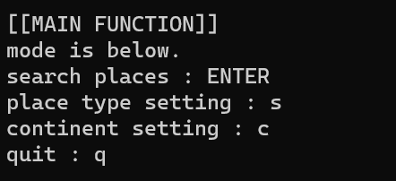
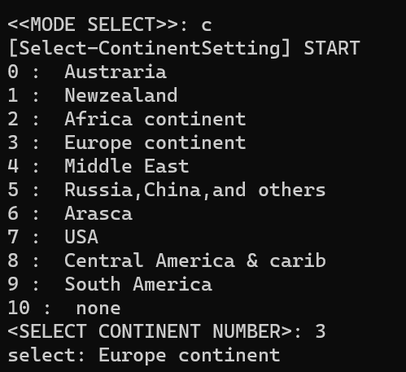
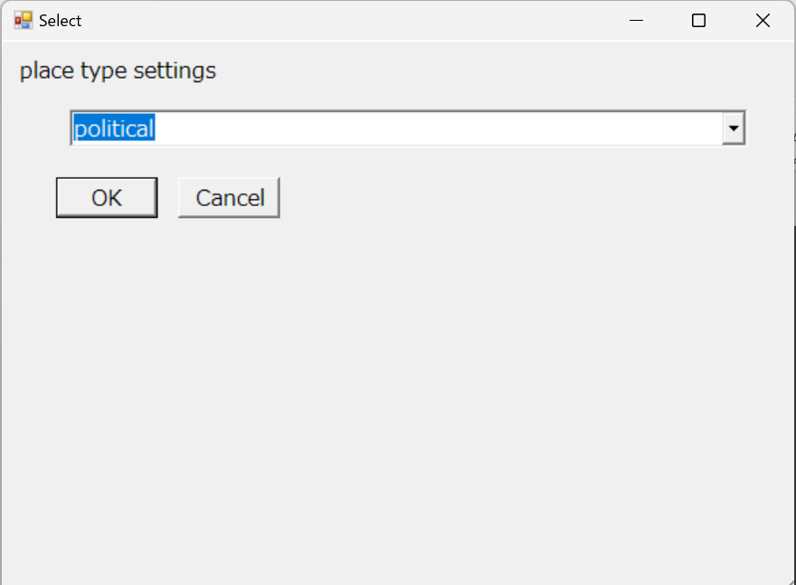
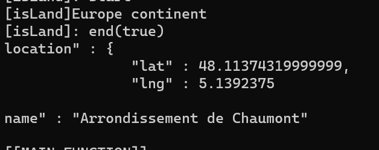
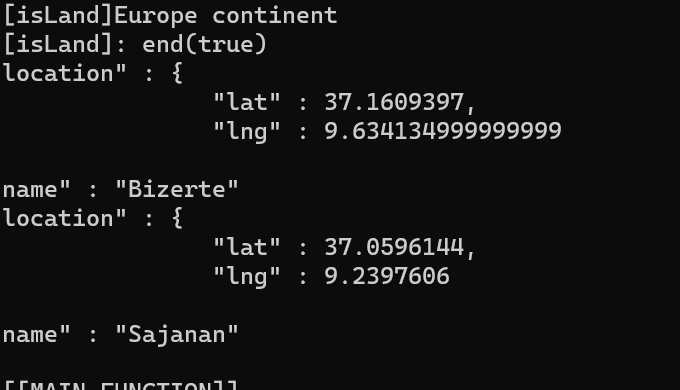

# powershell_ThePlaceAPI

## summary
get place information (political name:city,distorict area etc...) by Places API, the google Map with powershell

API's documentation: https://developers.google.com/maps/documentation/places/web-service/overview

## requirement
・Google Map's Developer account  
・Places API's API key  

## This repo's sample is below.
## main menu
  

## setting for continent
  

## setting for place type
  

## information sample1
  

## information sample2
  
